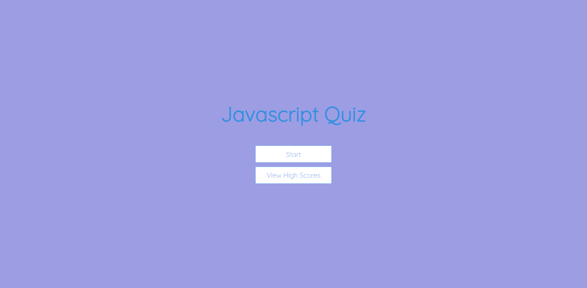
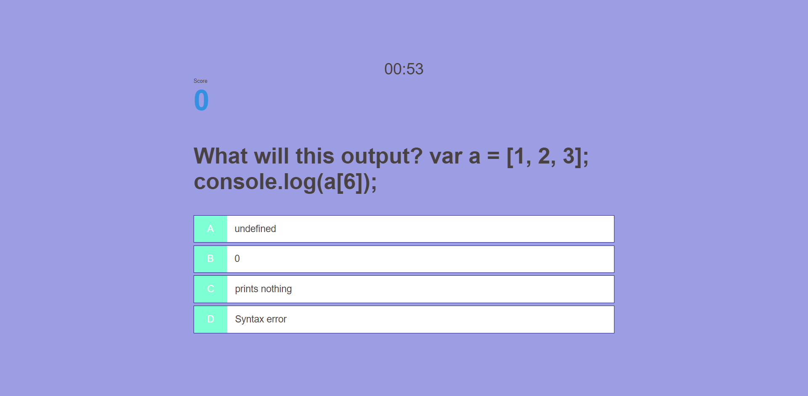
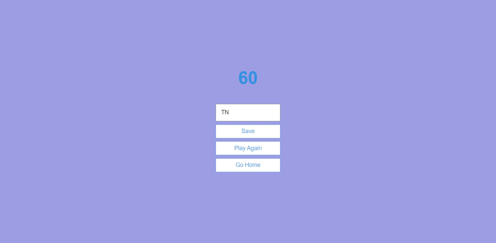
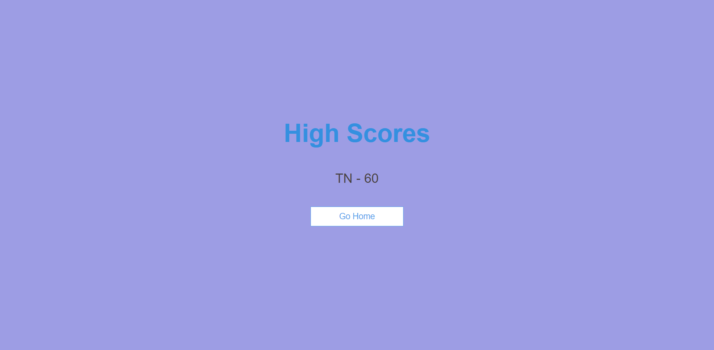

# Code Quiz

## Link to the Deployed Application

https://tigergiangnguyen.github.io/code-quiz/

## Description

For this weeks assignment, the instructions was to make a coding quiz and follow the acceptance criteria. This assigment didn't have a starter code therefore, the code is made from our knowledge and apply in class exercises. I didn't fully grasp the content using JavaScript and apply it to the assignment. To understand how to structure quiz and use HTML, CSS, and JavaScript. Adding comments to each functions helps me learn exactly what is it doing to the page.

## Screenshot of the Deloyed Application

## Usage

1. After the user clicks on "Start", the page will change windows into the main game where the user will see a timer, a score for each question the user gets correct, and the question with mutiple choices.

2. When the user answers the question correct, the button that they have chosen will turn green and the score will add 10 points then will have a small delay before moving to the next question. If the user answers the question wrong, the button chosen will turn red and the score will stay the same.

3. Either the user answers all questions or timer runs out, The user will lost all their point and the window will change to the ending page with the score that was correct. Here the user can add their initials and save it to the local storage.

4. User can see their high score by clicking "View High Scores". The user can also play again to get a better score If they answer any question(s) wrong.

## Credits

https://www.youtube.com/@JamesQQuick

## License

MIT License